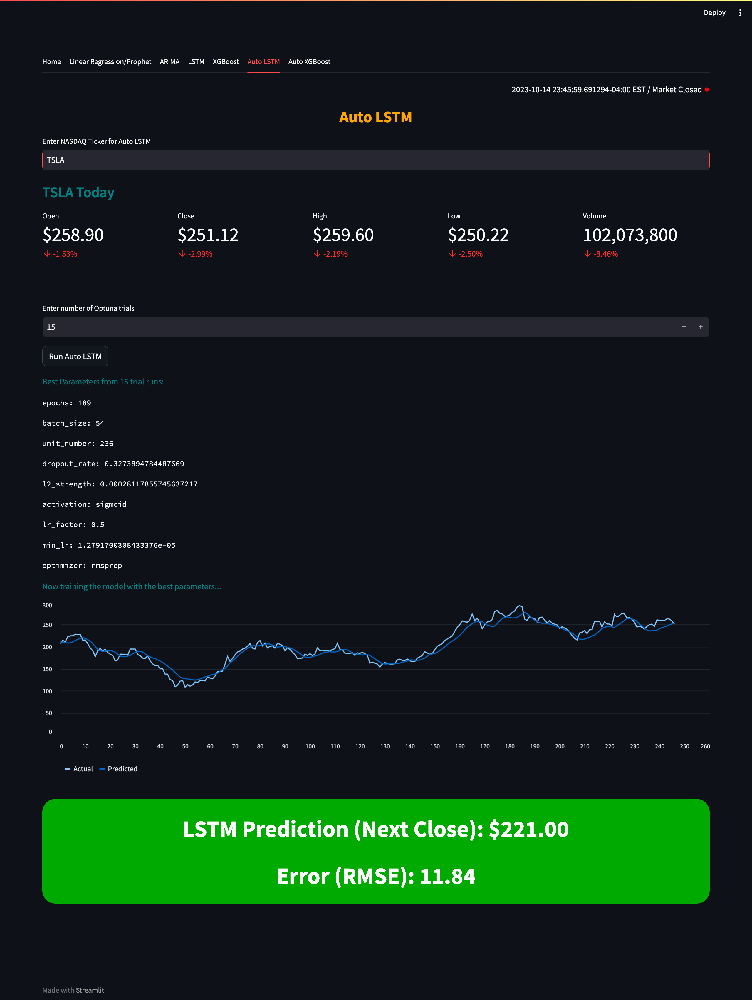

# Generating NASDAQ Alpha App
## Overview
Personal project which utilizes public APIs and libraries for ad-hoc data engineering, mixed in with data science tools and Optuna hyperparameter optimization to predict the next trading day close price of NASDAQ stocks. 

Is designed to be standalone for now, with no dedicated backend server or DB (Might add in the future) so isn't optimal for performance but still works lightweight and in-memory (handles caches for heavier runs).

Offers Linear Regression, FBProphet, ARIMA, LSTM and XGBoost with adjustable parameters

Also offers Optuna Hyperparameter optimization (auto find best parameters) for LSTM and XGBoost
- There is no 'one size fits all' for model architectures like ARIMA, LSTM, XGBoost so offering auto hyperparameter optimization using Optuna for LSTM and XGBoost for any NASDAQ asset, with ARIMA being auto-optimized using available libraries

In the future, might create a dedicated Optuna backend and backend server with a faster-serving frontend and make everything stateful.

## Screenshots
### Main Page


### Linear Regression & Prophet (Quick Train Models)


### ARIMA


### LSTM


### XGBoost


### Auto LSTM



### Auto XGBoost


## To reproduce (Local)
You just need to clone the repository and create a `.env` with just the FED API key:
- You can create a free Federal Reserve API key here: [FRED Link](https://fred.stlouisfed.org/docs/api/api_key.html)
```
# .env
FRED_API_KEY = <Your FED API Key>

# Optional:
LOG_PATH = "./logs/sys_logs.log"    # Will default to here if not specified
```
After you set up your FED API Key, you can just run streamlit after installing the `requirements.txt`
- Built on `Python 3.11.x` but should work on other python versions as well
```
~$ pip install -r requirements.txt

# Will defualt serve on http://localhost:8501
~$ streamlit run main.py
```

## Technologies Used
- Python (Pandas & related libraries)
- Tensorflow, Keras, Sklearn, Optuna
- Streamlit (HTML, CSS)

## Author
### Wonseok Choi
- [Github](https://github.com/iamwonseokchoi?tab=repositories)
- [Linkedin](https://www.linkedin.com/in/wonseok-c-387b57226/)